# Document Conversion Service - Technical System Design

> A microservices-based document conversion service that accepts PPTX/DOCX files and returns PDF or PNG outputs, using open-source Docker containers for rapid deployment.

---

## Table of Contents

- [Architecture Overview](#architecture-overview)
- [Core Components](#core-components)
- [Data Flow](#data-flow)
- [API Design](#api-design)
- [Docker Compose Configuration](#docker-compose-configuration)
- [PNG Conversion Strategy](#png-conversion-strategy)
- [Scaling & Load Balancing](#scaling--load-balancing)
- [Security Considerations](#security-considerations)
- [Monitoring & Observability](#monitoring--observability)
- [Alternative Solutions](#alternative-solutions)
- [Quick Start](#quick-start)
- [Resource Requirements](#resource-requirements)

---

## Architecture Overview

### High-Level System Architecture

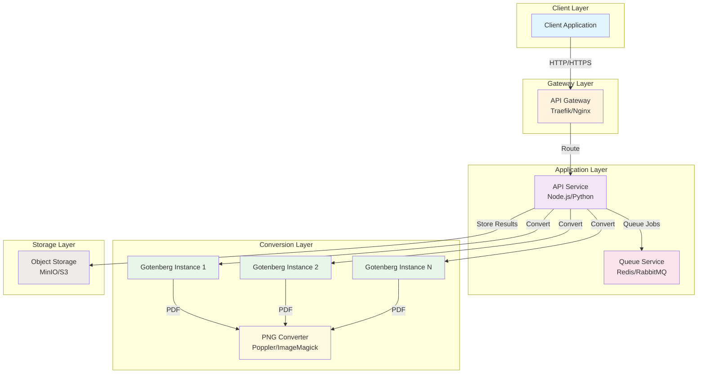

### Component Interaction

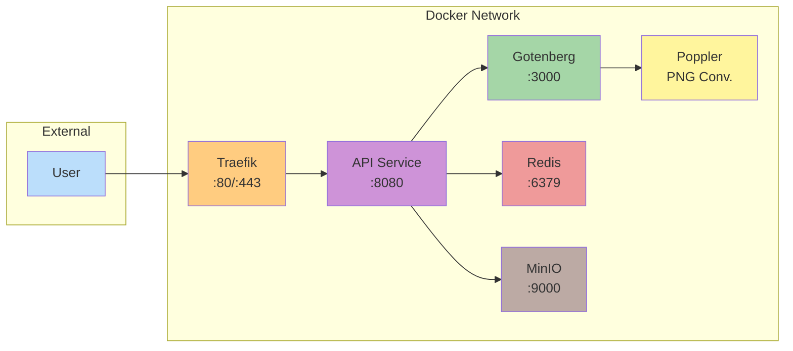

---

## Core Components

### 1. Conversion Engine: Gotenberg

**Why Gotenberg?**
- Purpose-built for document conversion
- Docker-native with REST API
- Uses LibreOffice for Office formats
- Active maintenance and excellent documentation

| Property | Value |
|----------|-------|
| **Docker Image** | `gotenberg/gotenberg:8` |
| **Default Port** | 3000 |
| **License** | MIT |
| **Supported Formats** | DOCX, PPTX, XLSX, ODT, ODP, HTML, Markdown |

### 2. API Gateway Options

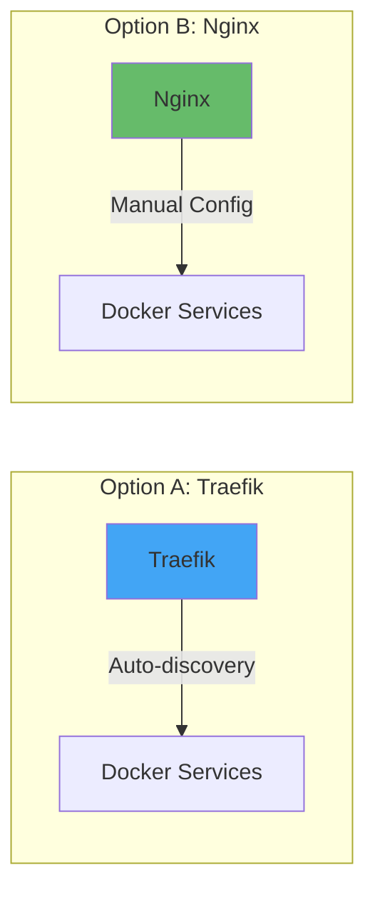

### 3. Queue Service

For handling async/batch processing:

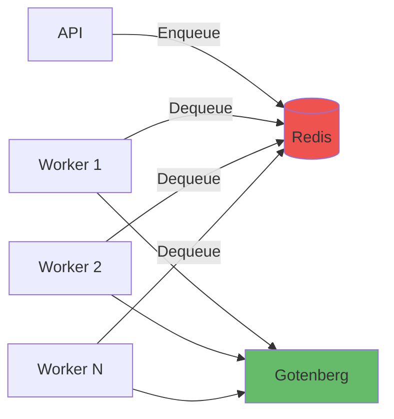

### 4. Object Storage

For handling large files and results:

| Service | Use Case | Docker Image |
|---------|----------|--------------|
| MinIO | Self-hosted S3-compatible | `minio/minio` |
| AWS S3 | Cloud production | N/A |
| Local Volume | Development | N/A |

---

## Data Flow

### Synchronous PDF Conversion

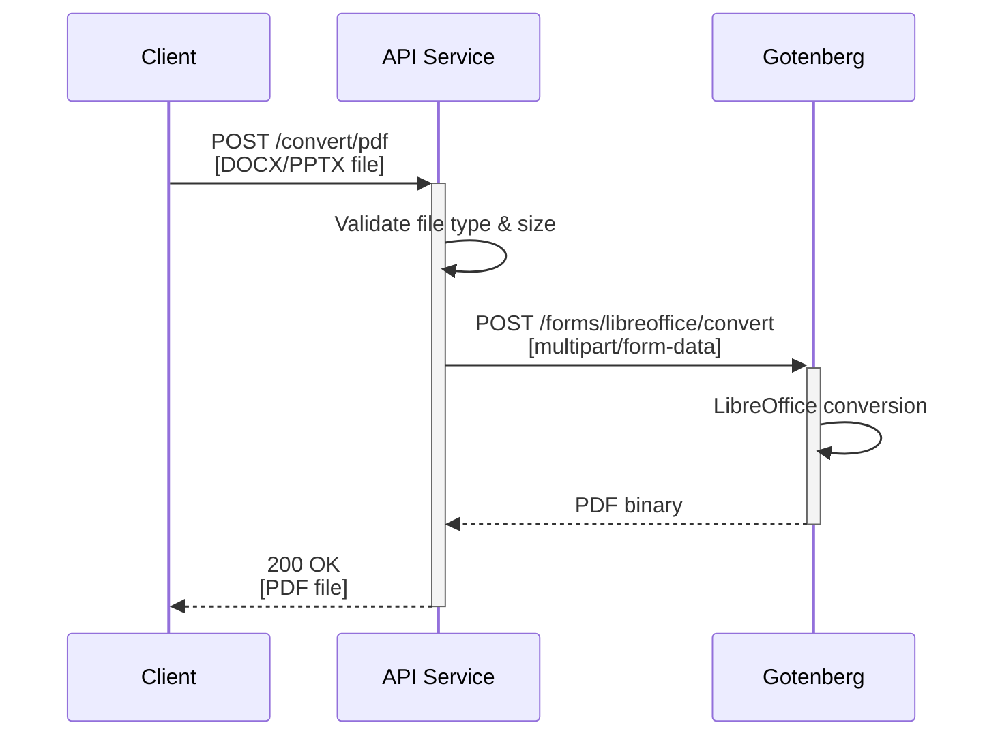

### Asynchronous PNG Conversion

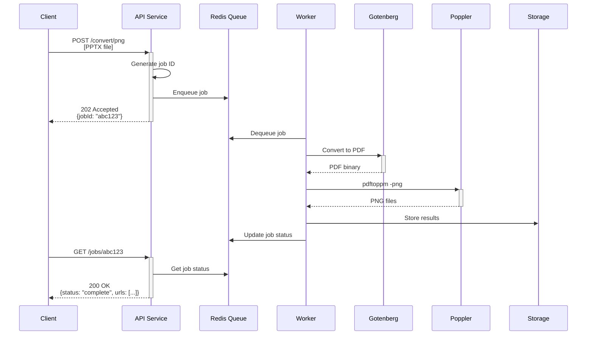

### Batch Processing Flow

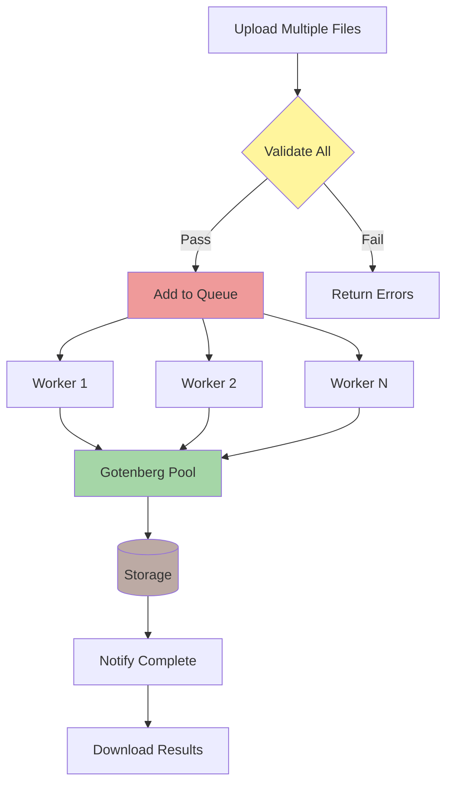

---

## API Design

### Endpoints

| Method | Endpoint | Description | Response |
|--------|----------|-------------|----------|
| `POST` | `/convert/pdf` | Sync PDF conversion | PDF binary |
| `POST` | `/convert/png` | Async PNG conversion | Job ID |
| `POST` | `/convert/batch` | Batch conversion | Job ID |
| `GET` | `/jobs/{id}` | Get job status | Job details |
| `GET` | `/jobs/{id}/download` | Download results | ZIP file |
| `GET` | `/health` | Health check | Status |

### Request/Response Flow

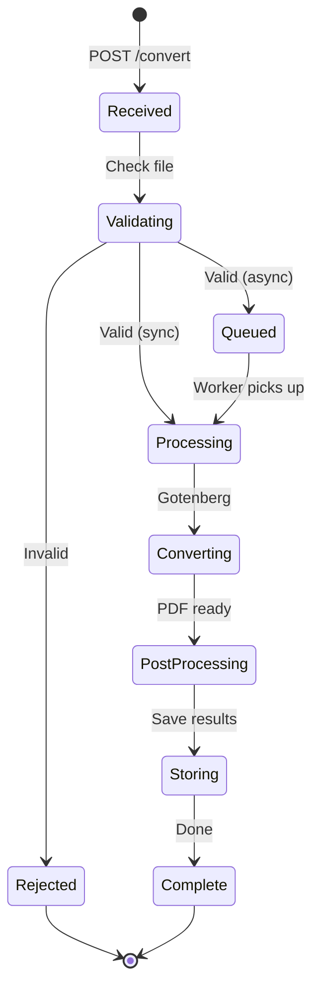

### Example API Calls

**PDF Conversion (cURL):**
```bash
curl -X POST http://localhost:8080/convert/pdf \
  -F "file=@presentation.pptx" \
  -o presentation.pdf
```

**PNG Conversion (cURL):**
```bash
# Submit job
curl -X POST http://localhost:8080/convert/png \
  -F "file=@document.docx" \
  -H "Content-Type: multipart/form-data"

# Response: {"jobId": "abc123", "status": "queued"}

# Check status
curl http://localhost:8080/jobs/abc123

# Download when complete
curl http://localhost:8080/jobs/abc123/download -o images.zip
```

---

## Docker Compose Configuration

### Complete Production Setup

```yaml
version: '3.8'

services:
  # Reverse Proxy / Load Balancer
  traefik:
    image: traefik:v2.10
    container_name: traefik
    restart: unless-stopped
    ports:
      - "80:80"
      - "443:443"
      - "8080:8080"  # Dashboard
    command:
      - "--api.dashboard=true"
      - "--providers.docker=true"
      - "--providers.docker.exposedbydefault=false"
      - "--entrypoints.web.address=:80"
      - "--entrypoints.websecure.address=:443"
    volumes:
      - /var/run/docker.sock:/var/run/docker.sock:ro
    labels:
      - "traefik.enable=true"
      - "traefik.http.middlewares.ratelimit.ratelimit.average=100"
      - "traefik.http.middlewares.ratelimit.ratelimit.burst=50"

  # API Orchestration Service
  api:
    build: ./api
    container_name: converter-api
    restart: unless-stopped
    environment:
      - NODE_ENV=production
      - GOTENBERG_URL=http://gotenberg:3000
      - REDIS_URL=redis://redis:6379
      - MINIO_ENDPOINT=minio
      - MINIO_PORT=9000
      - MINIO_ACCESS_KEY=minioadmin
      - MINIO_SECRET_KEY=minioadmin
    depends_on:
      - gotenberg
      - redis
      - minio
    labels:
      - "traefik.enable=true"
      - "traefik.http.routers.api.rule=Host(`converter.localhost`)"
      - "traefik.http.services.api.loadbalancer.server.port=8080"

  # Document Conversion Engine
  gotenberg:
    image: gotenberg/gotenberg:8
    container_name: gotenberg
    restart: unless-stopped
    command:
      - "gotenberg"
      - "--api-timeout=300s"
      - "--api-root-path=/"
      - "--libreoffice-restart-after=10"
      - "--libreoffice-max-queue-size=20"
      - "--log-level=info"
    deploy:
      resources:
        limits:
          cpus: '2'
          memory: 2G
        reservations:
          cpus: '1'
          memory: 1G
    healthcheck:
      test: ["CMD", "curl", "-f", "http://localhost:3000/health"]
      interval: 30s
      timeout: 10s
      retries: 3
      start_period: 10s

  # Queue Service
  redis:
    image: redis:7-alpine
    container_name: redis
    restart: unless-stopped
    command: redis-server --appendonly yes
    volumes:
      - redis_data:/data
    healthcheck:
      test: ["CMD", "redis-cli", "ping"]
      interval: 10s
      timeout: 5s
      retries: 5

  # PNG Conversion Sidecar
  poppler:
    image: minidocks/poppler
    container_name: poppler
    restart: unless-stopped
    volumes:
      - shared_tmp:/tmp/conversions

  # Object Storage
  minio:
    image: minio/minio
    container_name: minio
    restart: unless-stopped
    ports:
      - "9000:9000"
      - "9001:9001"
    environment:
      MINIO_ROOT_USER: minioadmin
      MINIO_ROOT_PASSWORD: minioadmin
    command: server /data --console-address ":9001"
    volumes:
      - minio_data:/data
    healthcheck:
      test: ["CMD", "curl", "-f", "http://localhost:9000/minio/health/live"]
      interval: 30s
      timeout: 20s
      retries: 3

volumes:
  redis_data:
  minio_data:
  shared_tmp:

networks:
  default:
    name: converter-network
```

### Minimal Development Setup

```yaml
version: '3.8'

services:
  gotenberg:
    image: gotenberg/gotenberg:8
    ports:
      - "3000:3000"
    command:
      - "gotenberg"
      - "--api-timeout=120s"
```

---

## PNG Conversion Strategy

### Pipeline Architecture

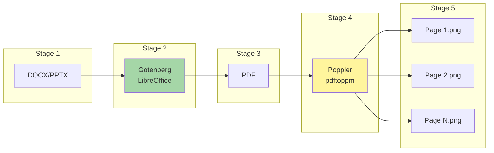

### Implementation Options

| Option | Tool | Docker Image | Pros | Cons |
|--------|------|--------------|------|------|
| A | Poppler | `minidocks/poppler` | Fast, lightweight | Limited options |
| B | ImageMagick | `dpokidov/imagemagick` | Full-featured | Larger image |
| C | Custom | Build from Gotenberg | Single container | More complex |

### PNG Conversion Commands

```bash
# Using pdftoppm (Poppler)
pdftoppm -png -r 150 input.pdf output
# Output: output-1.png, output-2.png, ...

# Using ImageMagick
convert -density 150 input.pdf -quality 90 output-%d.png

# High-quality presentation slides
pdftoppm -png -r 300 -cropbox presentation.pdf slide
```

---

## Scaling & Load Balancing

### Horizontal Scaling Architecture

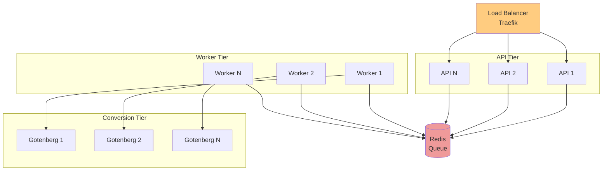

### Docker Swarm Scaling

```yaml
services:
  gotenberg:
    image: gotenberg/gotenberg:8
    deploy:
      replicas: 3
      resources:
        limits:
          cpus: '2'
          memory: 2G
      update_config:
        parallelism: 1
        delay: 10s
      restart_policy:
        condition: on-failure
```

### Kubernetes Deployment

```yaml
apiVersion: apps/v1
kind: Deployment
metadata:
  name: gotenberg
spec:
  replicas: 3
  selector:
    matchLabels:
      app: gotenberg
  template:
    metadata:
      labels:
        app: gotenberg
    spec:
      containers:
      - name: gotenberg
        image: gotenberg/gotenberg:8
        resources:
          limits:
            memory: "2Gi"
            cpu: "2"
          requests:
            memory: "1Gi"
            cpu: "1"
        ports:
        - containerPort: 3000
        livenessProbe:
          httpGet:
            path: /health
            port: 3000
          initialDelaySeconds: 10
          periodSeconds: 30
```

---

## Security Considerations

### Security Architecture

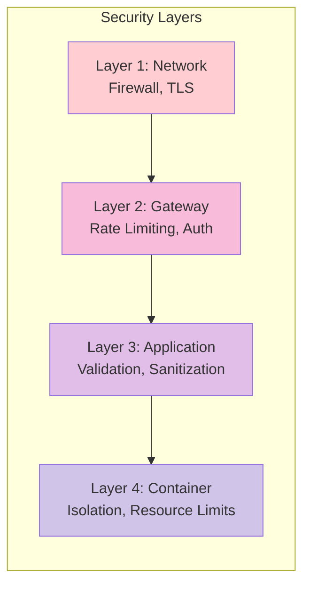

### Security Checklist

| Category | Measure | Implementation |
|----------|---------|----------------|
| **Input Validation** | File type check | MIME type + extension |
| **Input Validation** | File size limit | Max 50MB default |
| **Input Validation** | Filename sanitization | Remove special chars |
| **Rate Limiting** | Request throttling | 100 req/min per IP |
| **Authentication** | API keys | Header-based auth |
| **Network** | TLS encryption | Let's Encrypt certs |
| **Container** | Non-root user | Gotenberg default |
| **Container** | Resource limits | Memory & CPU caps |
| **Timeout** | Conversion timeout | 300s max |

### Traefik Security Middleware

```yaml
labels:
  # Rate limiting
  - "traefik.http.middlewares.ratelimit.ratelimit.average=100"
  - "traefik.http.middlewares.ratelimit.ratelimit.burst=50"
  
  # Headers
  - "traefik.http.middlewares.secure-headers.headers.framedeny=true"
  - "traefik.http.middlewares.secure-headers.headers.sslredirect=true"
  
  # IP whitelist (optional)
  - "traefik.http.middlewares.ipwhitelist.ipwhitelist.sourcerange=10.0.0.0/8"
```

---

## Monitoring & Observability

### Monitoring Stack

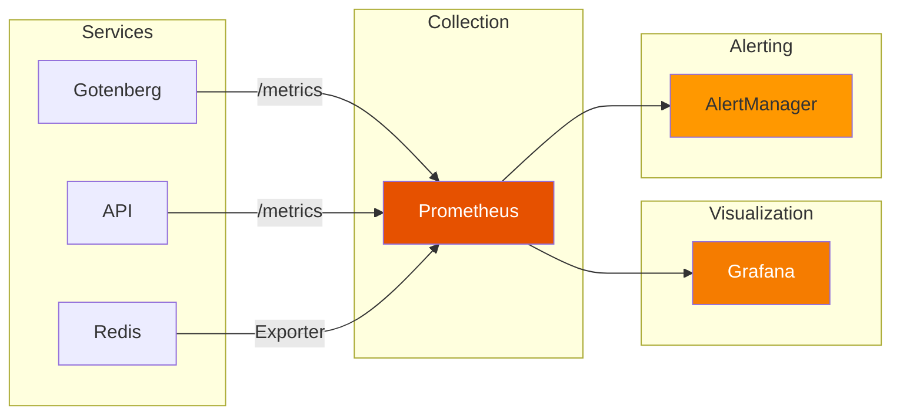

### Prometheus Configuration

```yaml
# prometheus.yml
global:
  scrape_interval: 15s

scrape_configs:
  - job_name: 'gotenberg'
    static_configs:
      - targets: ['gotenberg:3000']
    metrics_path: /prometheus/metrics
    
  - job_name: 'traefik'
    static_configs:
      - targets: ['traefik:8080']
    metrics_path: /metrics
    
  - job_name: 'redis'
    static_configs:
      - targets: ['redis-exporter:9121']
```

### Key Metrics to Monitor

| Metric | Description | Alert Threshold |
|--------|-------------|-----------------|
| `gotenberg_requests_total` | Total conversion requests | N/A |
| `gotenberg_requests_duration_seconds` | Conversion time | > 60s |
| `gotenberg_requests_queue_size` | Queue depth | > 50 |
| `process_resident_memory_bytes` | Memory usage | > 1.8GB |
| `redis_connected_clients` | Active connections | > 100 |

### Health Check Endpoints

| Service | Endpoint | Expected |
|---------|----------|----------|
| Gotenberg | `GET /health` | `{"status": "up"}` |
| API | `GET /health` | `{"status": "ok"}` |
| Redis | `redis-cli ping` | `PONG` |
| MinIO | `GET /minio/health/live` | `200 OK` |

---

## Alternative Solutions

### Comparison Matrix


### Solution Details

| Tool | Best For | Docker Image | License |
|------|----------|--------------|---------|
| **Gotenberg** | Production API service | `gotenberg/gotenberg:8` | MIT |
| **Stirling-PDF** | Self-hosted with UI | `frooodle/s-pdf` | GPL-3.0 |
| **LibreOffice** | Direct control | `libreoffice/libreoffice` | MPL-2.0 |
| **unoconv** | Simple CLI | `zrrrzzt/unoconv` | GPL |
| **Apache Tika** | Text extraction | `apache/tika` | Apache-2.0 |

---

## Quick Start

### 1. Minimal Setup (Development)

```bash
# Start Gotenberg only
docker run -d -p 3000:3000 gotenberg/gotenberg:8

# Test conversion
curl -X POST http://localhost:3000/forms/libreoffice/convert \
  -F "files=@document.docx" \
  -o document.pdf
```

### 2. Full Stack Setup

```bash
# Clone repository
git clone https://github.com/your-repo/doc-converter
cd doc-converter

# Start all services
docker-compose up -d

# Check health
curl http://localhost:3000/health

# View logs
docker-compose logs -f
```

### 3. Test Endpoints

```bash
# PDF conversion
curl -X POST http://localhost:8080/convert/pdf \
  -F "file=@presentation.pptx" \
  -o output.pdf

# PNG conversion (async)
curl -X POST http://localhost:8080/convert/png \
  -F "file=@document.docx"

# Check job status
curl http://localhost:8080/jobs/{jobId}
```

---

## Resource Requirements

### Sizing Guide

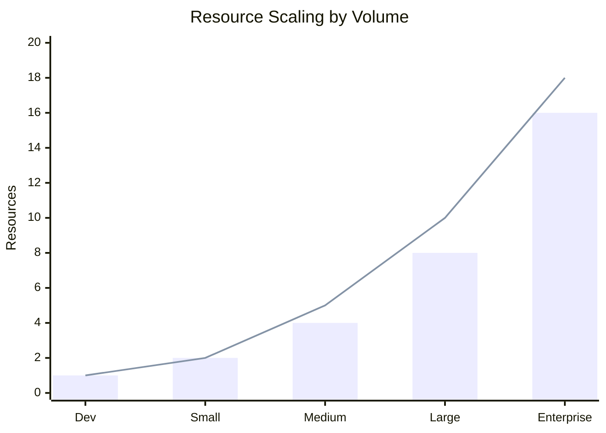

### Detailed Requirements

| Scale | Daily Volume | Gotenberg Instances | Memory | CPU | Storage |
|-------|--------------|---------------------|--------|-----|---------|
| **Dev/Test** | < 10 | 1 | 1 GB | 1 core | 5 GB |
| **Small** | < 100 | 1 | 2 GB | 2 cores | 20 GB |
| **Medium** | < 1,000 | 2-3 | 4 GB | 4 cores | 50 GB |
| **Large** | < 10,000 | 5-10 | 8 GB | 8 cores | 200 GB |
| **Enterprise** | 10,000+ | 10+ | 16+ GB | 16+ cores | 500+ GB |

### Cost Estimation (Cloud)

| Provider | Small | Medium | Large |
|----------|-------|--------|-------|
| AWS (ECS) | ~$50/mo | ~$150/mo | ~$400/mo |
| GCP (Cloud Run) | ~$40/mo | ~$120/mo | ~$350/mo |
| DigitalOcean | ~$30/mo | ~$80/mo | ~$200/mo |

---

## Conclusion

This design provides a scalable, production-ready document conversion service using proven open-source components. Key benefits:

- **Quick Deployment**: Single `docker-compose up` command
- **Scalable**: Horizontal scaling with load balancing
- **Reliable**: Health checks, retries, and queue-based processing
- **Secure**: Input validation, rate limiting, and container isolation
- **Observable**: Full metrics and logging stack

For questions or contributions, please open an issue on the project repository.

---

*Document Version: 1.0 | Last Updated: 2024*
